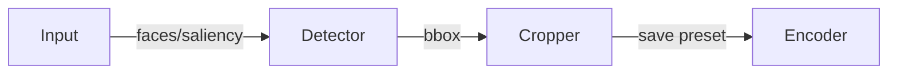

# Docs — Image Cover Cropper
Flow and tuning parameters (README unchanged).
## Flow

```mermaid
flowchart LR
  Input[Input] -->|faces/saliency| Detector[Detector]
  Detector[Detector] -->|bbox| Cropper[Cropper]
  Cropper[Cropper] -->|save preset| Encoder[Encoder]
```
